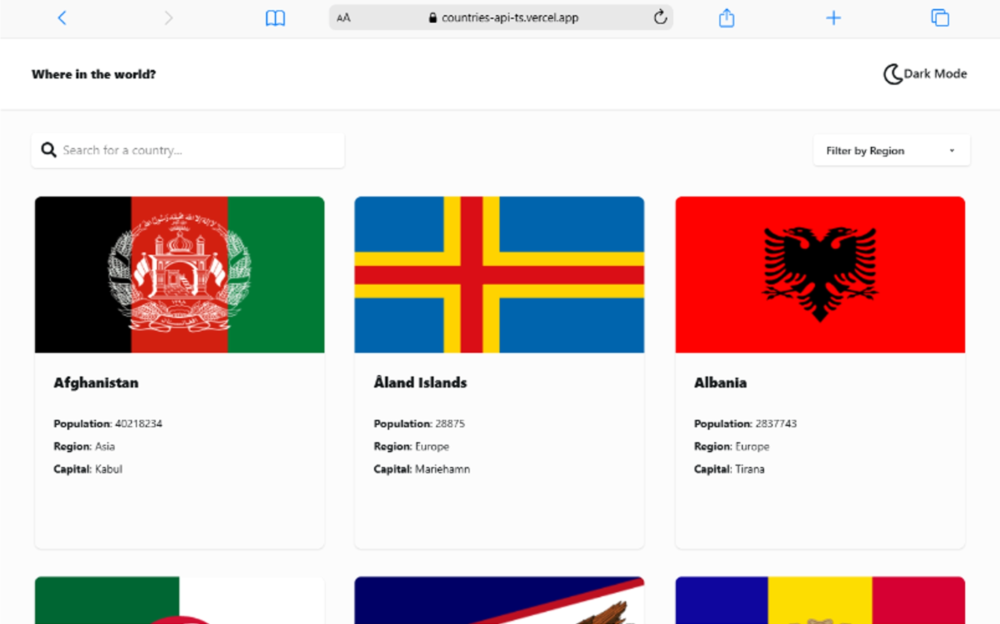
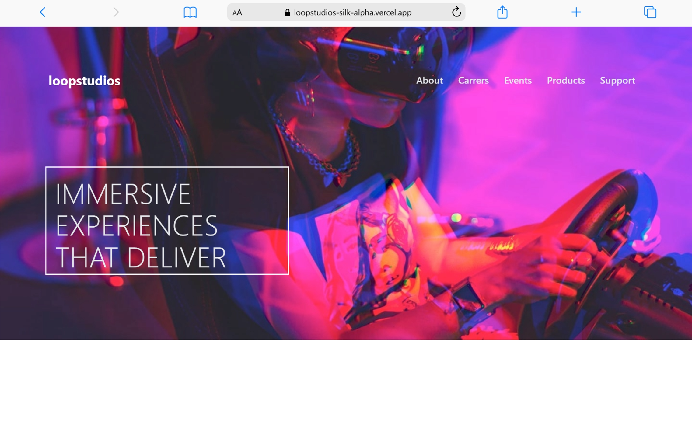

# Hey 👋 I'm Italo Marcelo

Frontend developer focused on React and modern web applications.

---
## 🚀 About Me
- 🌱 Learning Node.js, Express & MongoDB
- 🖥️ React + TypeScript
- 🎯 Focused on clean UI
- 🗺️ Brazil

## 🛠️ Tech Stack

   

## 📈 GitHub Stats

---

## 🔥 Contribution Graph

---

## Featured Projects

# 🚀 Featured Projects

<table >
<tr>

<td width="50%">

## Countries-API

pequena descrição 

### ⚡ Techs

### 🔗 Links

Live Demo
Repository

</td>

<td width="50%" align="center">

 

</td>

</tr>

<tr>

<td width="50%">

## LoopStudios 

pequena descrição 

### ⚡ Techs

### 🔗 Links

Live Demo
Repository

</td>

<td width="25%" align="center">

</td>

</tr>

<tr>

<td width="50%">

## Static-Job 

pequena descrição 

### ⚡ Techs

### 🔗 Links

Live Demo
Repository

</td>

<td width="50%" align="center">

 

</td>

</tr>

</table>

## 🌐 Contact

- LinkedIn
- Email
- Portfolio
