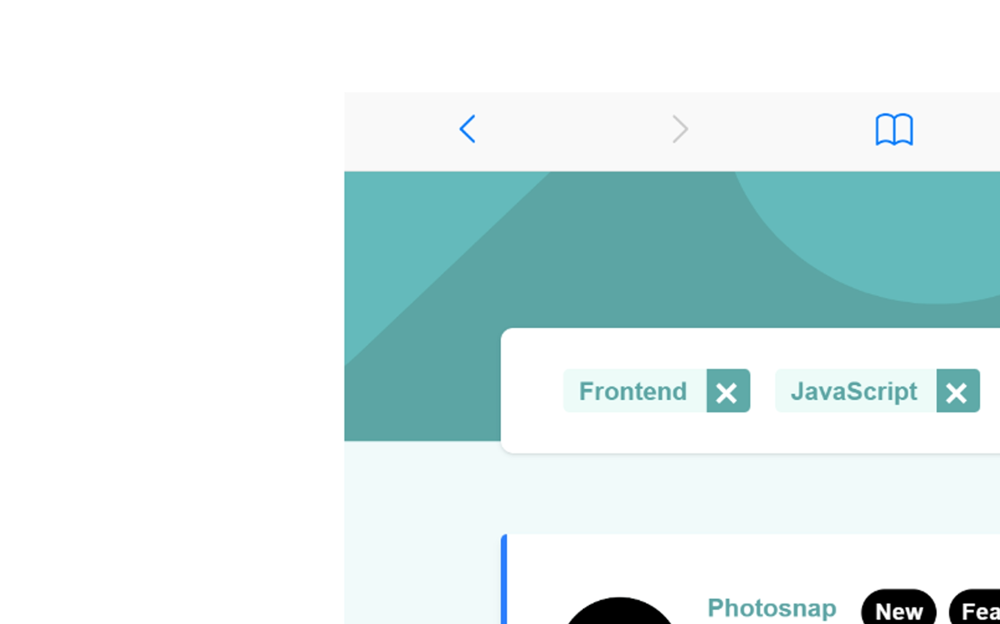

# Hey 👋 I'm Italo Marcelo

Frontend developer focused on React and modern web applications.

---
## 🚀 About Me
- 🌱 Learning Node.js, Express & MongoDB
- 🖥️ React + TypeScript
- 🎯 Focused on clean UI
- 🗺️ Brazil

## 🛠️ Tech Stack

   

## 📈 GitHub Stats

---

## 🔥 Contribution Graph

---

## Featured Projects

| Project | Preview |
|---|---|
| Countries-API |  |

| Project | Preview |
|---|---|
| LoopStudios |  |

| Project | Preview |
|---|---|
| Static-Job |  |

## 🌐 Contact

- LinkedIn
- Email
- Portfolio
